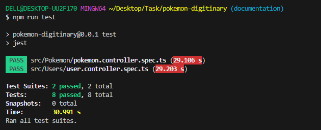

# NestJS Pokemon Go Project Documentation

## Overview

Welcome to the comprehensive documentation for the NestJS Pokemon Go project. This robust application facilitates CRUD (Create, Read, Update, Delete) operations, managing a dynamic Pokemon database while seamlessly integrating user authentication. Developed using NestJS, this documentation offers a detailed overview of the project's architecture, employed technologies, and instructions on running the application.

Explore the documentation to gain insights into the project's structure and learn how to interact with the Pokemon database securely through user authentication.

## Technologies Used

This section provides an overview of the technologies used in the project:

- **Node.js**: A runtime environment for executing JavaScript on the server.
- **NestJS**: A powerful and extensible framework for building server-side applications.
- **MongoDB**: A NoSQL database used for storing Pokemon and user data.
- **Prisma**: An ORM (Object-Relational Mapping) tool for efficient database access.
- **@nestjs/common**: A core module of NestJS for building controllers, modules, and providers.
- **@nestjs/jwt**: A module for handling JSON Web Tokens (JWT) in NestJS.
- **@nestjs/platform-express**: Express integration for NestJS.
- **@nestjs/swagger**: A module for automatically generating API documentation using Swagger.
- **bcrypt**: A library for hashing and verifying passwords securely.
- **class-transformer**: A library for transforming class objects.
- **class-validator**: A library for data validation.
- **dotenv**: A module for loading environment variables from a .env file.
- **xlsx**: A library for parsing Excel files.

## Database Information

Our project leverages MongoDB as the chosen database to store both Pokemon and user data. MongoDB, a NoSQL database, is employed for its versatility in handling unstructured data efficiently.

For a direct view of the live database and the stored Pokemon data, you can explore it on MongoDB Atlas using the following link: [MongoDB Atlas - Pokemon Database](https://cloud.mongodb.com/v2/65191f51f19864011c94f891#/metrics/replicaSet/65741753e99add6f389a140d/explorer/pokemonDatabase/Pokemon/find)..

Feel free to navigate the provided link to gain insights into the Pokemon dataset and interact with the stored information in real-time.

## Project Structure

The project is organized into the following key components:

### Controllers

#### AuthController

- Responsible for authentication and user-related operations.
- Endpoints:
  - `POST /auth/signin`: Log in a user to obtain an access token.

#### UserController

- Manages user-related operations and is protected with authentication guards.
- Endpoints:
  - `GET /user`: Retrieves all users.
  - `POST /user/addUser`: Registers a new user (Admin role required).
  - `PUT /user/:id`: Updates user information all keys you can update it.
  - `DELETE /user/:id`: Deletes a user (Admin role required).

#### PokemonController

- Handles Pokemon-related operations and is also protected with authentication guards.
- Endpoints:
  - `POST /pokemon/import`: Imports Pokemon data from an Excel file (Admin role required).
  - `POST /pokemon/newPokemon`: Creates a new Pokemon (Admin role required).
  - `PUT /pokemon/:id`: Updates Pokemon information all keys available to update(Admin role required).
  - `POST /pokemon/filter`: Retrieves Pokemon data with optional filtering and pagination.
  - `DELETE /pokemon/:id`: Deletes a Pokemon (Admin role required).

## Running the Project

To run the project, follow these steps:

1. Make sure you have Docker and Docker Compose installed on your system.
2. Open a terminal and navigate to the project directory with your `docker-compose.yml` file.
3. Run the following command to start the project using Docker Compose:

   ```bash
   docker-compose up
   ```

4. After the containers are up and running, you can access Swagger documentation at:
 [Swagger-Documentation](http://localhost:8080/docs-pokemon-api).

To access our APIs, please follow these steps to log in with the provided credentials:

- **Email**: 'odai@pokemon.go'
- **Password**: 'odai-pokemongo'

After logging in, navigate to the Swagger interface, click "Authorize," and fill in the "Bearer" field with the obtained access token.

## Running Tests

To run tests for the project, follow these steps:

1. Make sure you have Node.js and npm installed on your system.

2. Navigate to the project directory using the terminal.

3. Run the following command to install the project's dependencies:

   ```bash
   npm install
   npm run test
   ```

## Test Results

Below is an example of test results:



Explore and enjoy working with the NestJS Pokemon Go project!
